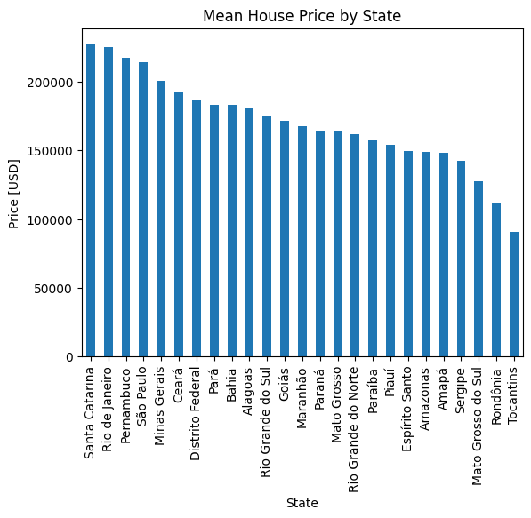
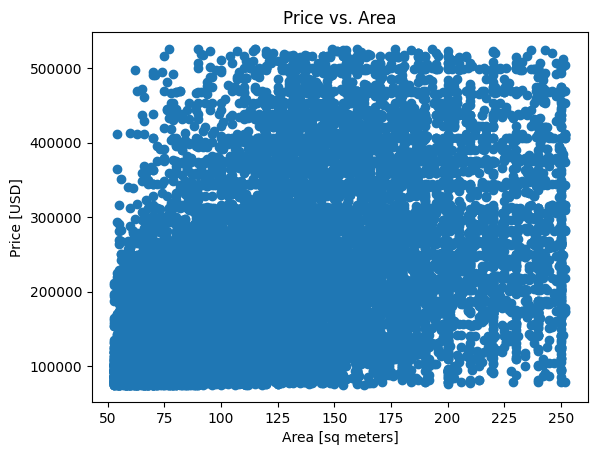

# Hacad Devlog – Brazil Real Estate Data Exploration

This repository contains my data wrangling and exploratory analysis of Brazilian real estate datasets.  
It’s part of my personal devlog, where I document hands-on projects, learning experiments, and visualizations.

---

## 📂 Repository Structure

hacad-devlog/
├─ notebooks/
│ └─ data-wrangling-and-exploration.ipynb # runnable notebook
├─ reports/
│ └─ data-wrangling-and-exploration.md # narrative write-up
├─ scripts/
│ └─ wrangle_real_estate.py # Python script version
├─ figures/
│ ├─ mean_house_price_by_state.png
│ └─ price_vs_area.png
└─ README.md

---

## 🛠️ Project Overview

The analysis focuses on two real estate datasets from Brazil.  
Key steps included:

- Data cleaning (removing nulls, parsing coordinates, handling currency conversions).
- Wrangling into a unified dataset of ~22,000 properties.
- Visualizing price trends by state and exploring the relationship between property size and price.

---

## 📊 Visualizations

**Mean House Price by State**  

**Price vs. Area**  

---

## 🔍 Files Explained

- **`notebooks/data-wrangling-and-exploration.ipynb`** → Jupyter Notebook with all code, outputs, and analysis.
- **`reports/data-wrangling-and-exploration.md`** → Clean Markdown write-up for easy reading on GitHub.
- **`scripts/wrangle_real_estate.py`** → Script version of the notebook (raw source code).
- **`figures/`** → Plots generated during the exploration.

---

## 📌 Key Insights

- 🏠 **State-level differences**: Santa Catarina, Rio de Janeiro, and Pernambuco show the highest mean property prices.
- 📏 **Area vs. Price**: Larger properties _can_ be more expensive, but the relationship is not strictly linear.
- 🌍 **Coverage**: Dataset spans multiple states and regions across Brazil.

---

## 🚀 Next Steps

- Explore more advanced models (e.g., regression) to quantify price predictors.
- Add interactive dashboards using Plotly or Streamlit.
- Expand devlog with new datasets and methods.

---

## 📖 About

This project is part of my **hacad-devlog**, where I record coding experiments, data projects, and learning journeys.  
Stay tuned for more explorations 👨‍💻
